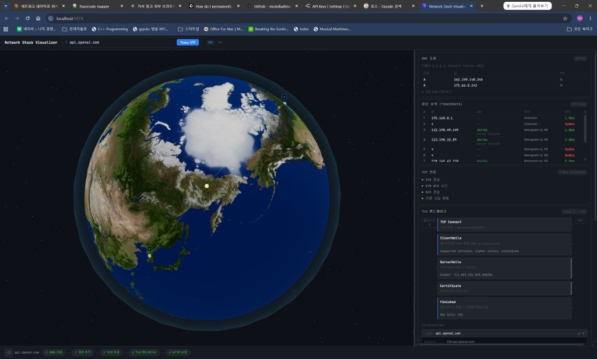

# Network Stack Visualizer

도메인 하나를 입력하면 **DNS → Traceroute → TCP → TLS → HTTP** 전 과정을 실시간으로 시각화하는 네트워크 진단 도구입니다.  
3D 지구본 위에 실제 라우팅 경로가 호(arc)로 그려지고, 각 홉의 RTT·AS 정보·지리 위치를 패널에서 확인할 수 있습니다.



---

## 주요 기능

| 기능 | 설명 |
|------|------|
| **3D 글로브** | Three.js 기반 지구본에 traceroute 경로를 실시간 스트리밍 표시 |
| **DNS 조회** | A/AAAA/CNAME 레코드 체인 시각화 |
| **Traceroute** | RTT 기반 색상 arc (녹색 → 노랑 → 주황 → 빨강) |
| **TCP 연결** | SYN → SYN-ACK → ACK 3-way handshake 단계 표시 |
| **TLS 핸드셰이크** | 버전·암호 스위트·인증서 체인 파싱 |
| **HTTP 프로브** | 상태 코드·응답 헤더·리다이렉트 체인 |
| **MITM 탐지** | 인증서 발급자 분석으로 SSL Inspection(기업 방화벽) 탐지 |
| **다국어** | 한국어 / English 전환 지원 |

---

## 기술 스택

**Backend** — Python 3.14+, FastAPI, uvicorn  
**Frontend** — React 19, TypeScript, Vite, Three.js (`@react-three/fiber`), Zustand

---

## 셋업 (로컬 실행)

### 사전 요구사항

- [uv](https://docs.astral.sh/uv/) (Python 패키지 매니저)
- Node.js **20** 이상 (npm 포함)
- Windows: `tracert` 명령이 PATH에 있어야 합니다 (기본 포함)
- macOS/Linux: `traceroute` 패키지 설치 필요

### 1. 저장소 클론

```bash
git clone https://github.com/your-username/network-vis.git
cd network-vis
```

### 2. 백엔드 설정

```bash
uv sync
```

### 3. 백엔드 실행

```bash
uv run uvicorn main:app --reload --port 8000
```

> API 서버가 `http://localhost:8000` 에서 실행됩니다.

### 4. 프론트엔드 설정 및 실행

```bash
cd frontend
npm install
npm run dev
```

> 개발 서버가 `http://localhost:5173` 에서 실행됩니다.

### 5. 브라우저에서 열기

```
http://localhost:5173
```

상단 입력창에 도메인(예: `api.openai.com`)을 입력하고 **Trace 시작** 버튼을 클릭하면 됩니다.

---

## 프로젝트 구조

```
network-vis/
├── main.py              # FastAPI 앱 진입점
├── pyproject.toml       # Python 의존성
├── api/
│   ├── router.py        # API 엔드포인트 (/api/dns, /api/hops, /api/tls, ...)
│   ├── traceroute.py    # traceroute 스트리밍 + GeoIP 조회
│   ├── dns_lookup.py    # DNS 레코드 체인 조회
│   ├── tls.py           # TLS 핸드셰이크 파싱
│   ├── http_probe.py    # HTTP 프로브
│   ├── mitm.py          # MITM(SSL Inspection) 탐지
│   ├── geo.py           # IP → 위경도 변환 (GeoIP)
│   └── as_info.py       # ASN 조회
└── frontend/
    ├── package.json
    └── src/
        ├── components/
        │   ├── globe/   # Three.js 3D 지구본 컴포넌트
        │   └── panels/  # DNS·Traceroute·TLS·HTTP 정보 패널
        ├── store/       # Zustand 전역 상태
        └── utils/       # geo 변환 등 유틸리티
```

---

## API 엔드포인트

| 엔드포인트 | 메서드 | 설명 |
|-----------|--------|------|
| `GET /api/dns?host=<domain>` | GET | DNS 레코드 체인 |
| `GET /api/hops?host=<domain>` | GET (SSE) | Traceroute 스트리밍 |
| `GET /api/tls?host=<domain>` | GET | TLS 핸드셰이크 정보 |
| `GET /api/http?host=<domain>` | GET | HTTP 프로브 결과 |
| `GET /health` | GET | 헬스 체크 |

---

## 라이선스

MIT
