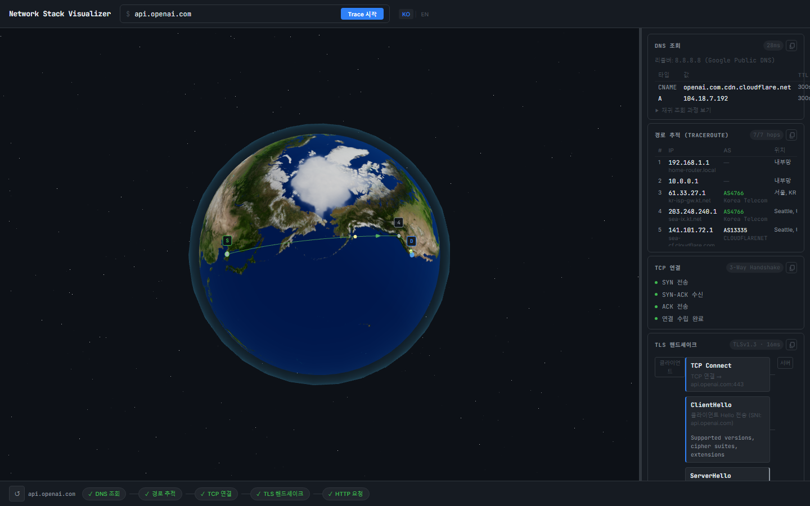
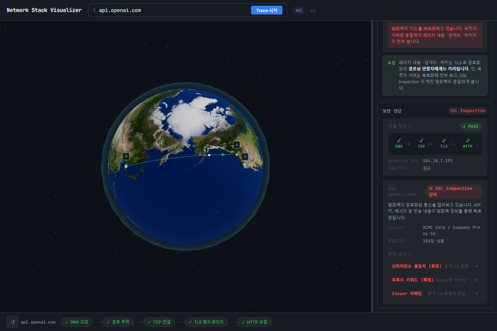

# Network Stack Visualizer

사내망에서 서비스가 차단됐을 때 **어느 레이어(DNS / IP / SNI / HTTP)에서 막혔는지** 실시간으로 보여주는 네트워크 진단 도구.  
도메인을 입력하면 DNS → Traceroute → TLS → HTTP 전 과정을 3D 지구본과 패널로 시각화하고, 기업 방화벽의 SSL Inspection 여부까지 판정합니다.



---

## 주요 기능

| 기능 | 설명 |
|---|---|
| **3D 글로브** | Traceroute 홉을 RTT 기반 색상 arc로 실시간 스트리밍 표시 |
| **DNS 체인** | Root NS → TLD NS → Authoritative NS 재귀 조회 과정 시각화 |
| **Traceroute** | 홉별 AS·위치·RTT. 사설 IP 홉은 "내부망"으로 자동 구분 |
| **TLS 핸드셰이크** | 버전·암호 스위트·인증서 체인 파싱 |
| **HTTP 프로브** | 상태 코드·헤더. SSL Inspection 환경에서도 실제 상태 반환 |
| **보안 진단** | 방화벽 차단 레이어 판정 + SSL Inspection 탐지 |
| **다국어** | 한국어 / English |

---

## 보안 진단



**차단 레이어 판정** — DNS / IP / SNI(도메인) / HTTP 중 어디서 막혔는지 표시합니다.

**SSL Inspection 탐지** — 공개 CA 번들(certifi)과 OS 신뢰저장소로 인증서를 이중 검증합니다.  
공개 CA로는 실패하지만 PC의 저장소로는 성공하면 → 방화벽이 TLS를 복호화하는 중(`INTERCEPTED`).

```
certifi(공개 CA)로 검증 실패
        ↓
OS 신뢰저장소(사내 CA)로 검증 성공
        ↓
INTERCEPTED — 방화벽이 내용을 열어보고 있음
```

---

## 기술 스택

**Backend** — Python 3.13+, FastAPI, uvicorn, certifi, truststore  
**Frontend** — React 19, TypeScript, Vite, Three.js (`@react-three/fiber`), Zustand

---

## 셋업

### 사전 요구사항

- [uv](https://docs.astral.sh/uv/)
- Node.js 20+
- Windows: `tracert` 기본 포함 / macOS·Linux: `traceroute` 설치 필요

### 실행

```bash
# 백엔드
uv sync
uv run uvicorn main:app --reload --port 8000

# 프론트엔드 (별도 터미널)
cd frontend
npm install
npm run dev
```

브라우저에서 `http://localhost:5173` 접속 후 도메인 입력.

### 팀 공유 시

프론트엔드를 빌드해 공용 서버에 올린 뒤 각 PC에서 백엔드만 실행:

```bash
# 프론트엔드 빌드
cd frontend && npm run build

# 백엔드 환경변수로 프론트 API 경로 지정 (기본값: http://localhost:8000/api)
VITE_API_BASE=http://localhost:8000/api npm run build
```

### 테스트

```bash
uv run pytest -q
```

---

## API 엔드포인트

| 엔드포인트 | 설명 |
|---|---|
| `GET /api/dns?host=` | DNS 체인 + GeoIP |
| `GET /api/traceroute?host=` | Traceroute SSE 스트리밍 |
| `GET /api/tls?host=` | TLS 핸드셰이크 + 인증서 + MITM/차단 진단 |
| `GET /api/http?host=` | HTTP 프로브 |
| `GET /health` | 헬스 체크 |

---

## 프로젝트 구조

```
network-vis/
├── main.py
├── pyproject.toml
├── api/
│   ├── router.py        # API 엔드포인트
│   ├── traceroute.py    # Traceroute 스트리밍 + GeoIP
│   ├── dns_lookup.py    # DNS 재귀 체인
│   ├── tls.py           # TLS + 신뢰저장소 이중 검증
│   ├── http_probe.py    # HTTP 프로브
│   ├── mitm.py          # SSL Inspection 탐지
│   ├── geo.py           # GeoIP
│   └── ipclass.py       # 사설 IP 분류
├── tests/
└── frontend/
    └── src/
        ├── components/
        │   ├── globe/   # Three.js 지구본
        │   └── panels/  # 진단 패널
        ├── store/       # Zustand 상태
        └── utils/
```

---

## 라이선스

MIT
